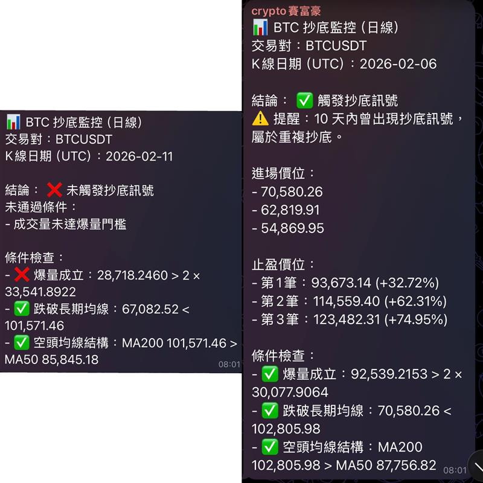

# BTC Bottom Detector (Daily)

English version: see `README_ENG.md`.

使用 Binance `BTCUSDT` **日線**資料做抄底偵測，並將結果送到 Telegram 群組。  
進場價位用條列顯示。

邏輯說明：
- 🔹均線50與均線200死叉，是傳統機構定義的熊市，因此在這個背景下容易抄到底
- 🔹爆量，頂底通常會有爆量



## 功能

- 每次執行會判斷「最新已收盤日 K」是否觸發抄底訊號。
- 所有結果（有訊號/無訊號）發送到 Telegram 群組。
- 訊號成立時，訊息會顯示：
  - 第一進場價位（當根日 K 收盤價）
  - 第二進場價位（最多兩個週線 V 點價位）
  - 止盈價位（最多三個週線反轉高點）

## 策略與進場掛單條件

### 日線抄底訊號條件

1. 爆量：`volume > SMA20(volume) * 2.0`
2. 收盤價低於 MA200：`close < MA200`
3. 均線結構：`MA200 > MA50`

### 第二進場（週線 V 點）邏輯
此為SNR支撐水平的應用，周線級別的開收盤價在SNR理論中為強支撐，掛單在此處容易反彈or反轉
- V 定義：`一根下跌週K + 下一根上漲週K`
- 候選價位：下跌週K的收盤價

### 止盈價位（週線反轉高點）邏輯
- 只在「完整抄底訊號成立」時顯示在同一則 Telegram 訊息
- 候選定義：`一根上漲週K + 下一根下跌週K`
- 候選價位：上漲週K的收盤價
- 最多顯示三筆，預設每筆至少相隔 `5%`
- 若 5% 規則下不足三筆，會自動放寬規則補找
- 若仍找不到，顯示：`價格創新高，建議根據50日均線移動止盈`


## 專案檔案

- `main.py`：主程式
- `requirements.txt`：依賴套件
- `.env.example`：環境變數範例

## 安裝環境

```bash
cd btc-bottom-detector-release
python3 -m venv .venv
source .venv/bin/activate
pip install -r requirements.txt
```

## 設定環境變數

先建立 `.env`：

```bash
cp .env.example .env
```

編輯 `.env`：

```env
TELEGRAM_BOT_TOKEN=123456789:your_bot_token
TELEGRAM_CHAT_ID=-1001234567890
BINANCE_SYMBOL=BTCUSDT
```

載入設定並執行：

```bash
set -a
source .env
set +a
python3 main.py
```

## Telegram 設定提醒

- 先把 Bot 加入目標群組。
- 確保 Bot 具有發送訊息權限。
- `TELEGRAM_CHAT_ID`：接收所有訊號結果的群組

## 排程建議（重要）

請在**你自己的時區**，設定為「每日收盤後再延遲一點點」執行，避免資料剛收線還未穩定。  

- 以 Binance 日線（UTC 00:00 收線）為例：
  - 台北時間（UTC+8）約為早上 `08:00` 收線
  - 建議排程在 `08:01` 之後（例如 `08:03`）

## crontab 範例（台北時區）

```bash
CRON_TZ=Asia/Taipei
3 8 * * * cd /path/to/btc-bottom-detector-release && set -a && source .env && set +a && /path/to/btc-bottom-detector-release/.venv/bin/python main.py >> detector.log 2>&1
```

## 注意事項

- 本工具只做訊號通知，不構成投資建議。
